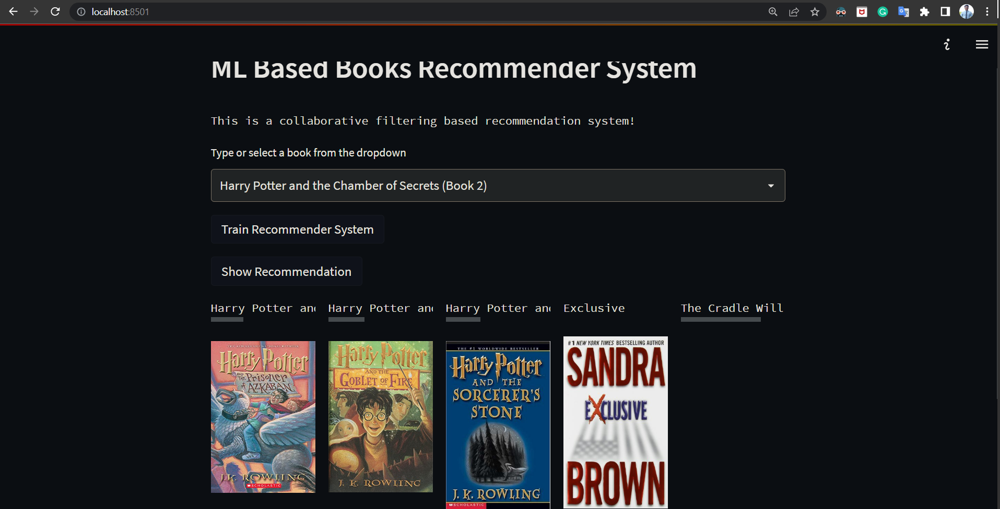
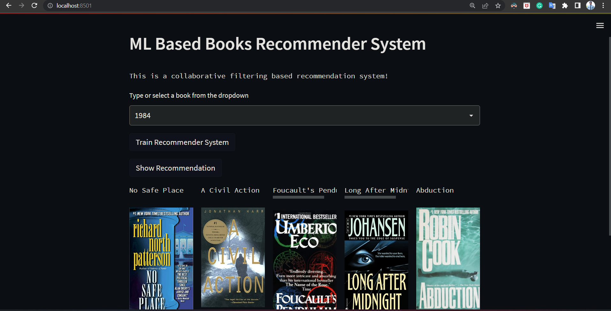

# Book Recommendation System  | Collaborative Filtering Based

The purpose of a recommendation system basically is to search for content that would be interesting to an individual. Moreover, it involves a number of factors to create personalised lists of useful and interesting content specific to each user/individual. Recommendation systems are Artificial Intelligence based algorithms that skim through all possible options and create a customized list of items that are interesting and relevant to an individual. These results are based on their profile, search/browsing history, what other people with similar traits/demographics are watching, and how likely are you to watch those movies. This is achieved through predictive modeling and heuristics with the data available.

# Types of Recommendation System :

### 1 ) Collaborative Based :
		
- Collaborative filtering systems, which are based on user-item interactions.
	
- Clusters of users with same ratings , similar users .
	
- Book recommendation , so use cluster mechanism .
	
- We take only one parameter , ratings or comments .
	
- In short, collaborative filtering systems are based on the assumption that if a user likes item A and another user likes the same item A as well as another item, item B, the first user could also be interested in the second item . 
	
- Issues are :

	- User-Item nXn matrix , so computationally expensive .

	- Only famous items will get reccomended .

	- New items might not get reccomended at all .   

### 2 ) Hybrid Based :
	
- Hybrid systems, which combine both types of information with the aim of avoiding problems that are generated when working with just one kind.

- Combination of both and used now a days .

- Uses : word2vec , embedding .           

# About this project:

This is a collaborative filtering based books recommender system & a streamlit web application that can recommend various kinds of similar books based on an user interest.


# Demo:






# Dataset has been used:

* [Dataset link](https://www.kaggle.com/ra4u12/bookrecommendation)

# Concept used to build the model.pkl file : NearestNeighbors

1 . Load the data
	
2 . Initialise the value of k

3 . For getting the predicted class, iterate from 1 to total number of training data points

4 . Calculate the distance between test data and each row of training data. Here we will use Euclidean distance as our distance metric since it’s the most popular method. 

5 . Sort the calculated distances in ascending order based on distance values
	
6 . Get top k rows from the sorted array

# Built With
1. streamlit
2. Machine learning
3. sklearn

# How to run?
### STEPS:

Clone the repository

```bash
https://github.com/entbappy/ML-Based-Book-Recommender-System.git
```
### STEP 01- Create a conda environment after opening the repository

```bash
conda create -n books python=3.7.10 -y
```

```bash
conda activate books
```


### STEP 02- install the requirements
```bash
pip install -r requirements.txt
```


Now run,
```bash
streamlit run app.py
```

```bash
Note: Before clicking on show recommendations first of all click on Train Recommender System for generating models
```
To view your app, users can browse to http://0.0.0.0:8501 or http://127.0.0.1:8501/


